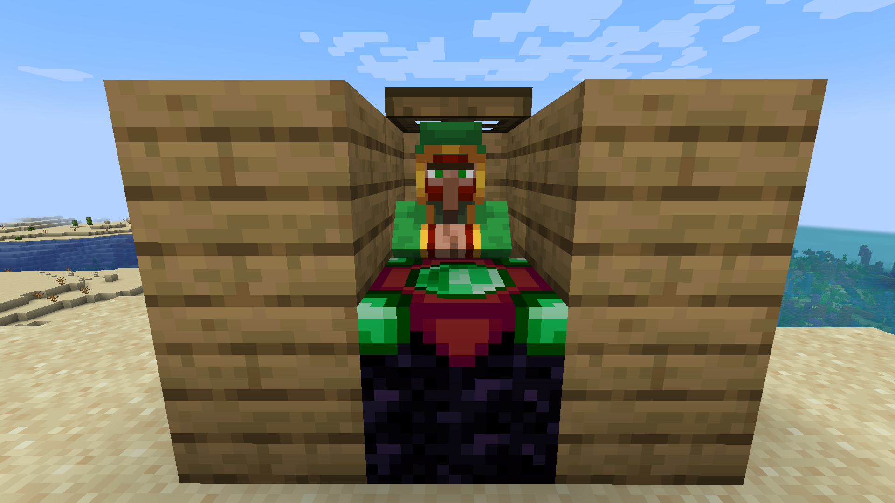
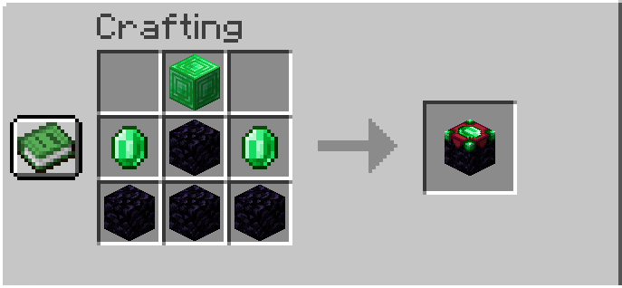

# XP Trader

`XP Trader` is a Minecraft Forge `1.20.1` mod that adds a new villager profession focused on converting player XP levels into emeralds.

## Overview
- Loader: Forge `47.x`
- Minecraft: `1.20.1`
- Java: `17`
- Mod ID: `xp_trader`
- Current version: `1.0.0`

## Features
- New villager profession: `xp_trader`
- New workstation block: `xp_trader_workstation`
- Vanilla-style profession pickup (unemployed villager + workstation)
- Standard villager trading UI
- Trade cost shown with `Bottle o' Enchanting` icon
- Real cost paid in **player XP levels**
- Villager progression from level 1 to 5
- Balance fully configurable through common config
- Custom villager and workstation textures

## Workstation Recipe
Inspired by the enchanting table recipe:

```text
 B
EOE
OOO
```

`B = Emerald Block`, `E = Emerald`, `O = Obsidian`

## Screenshots



## Configuration
Config file:

`run/config/xp_trader-common.toml`

Main keys:
- `levelsPerTradeByLevel`
- `emeraldsPerTradeByLevel`
- `maxUsesPerTradeByLevel`
- `villagerXpPerTradeByLevel`

Default values:
- `levelsPerTradeByLevel = [12, 20, 24, 28, 32]`
- `emeraldsPerTradeByLevel = [1, 2, 3, 4, 5]`
- `maxUsesPerTradeByLevel = [16, 14, 12, 10, 8]`
- `villagerXpPerTradeByLevel = [2, 5, 10, 15, 20]`

Validation rules:
- Each list must contain exactly 5 positive integers
- Invalid values fall back to defaults with a warning log

## Run and Build
Requirements:
- Java 17
- Project Gradle Wrapper

Commands:

```powershell
.\gradlew.bat runClient
.\gradlew.bat build
```

Output jar:

`build/libs/xp_trader-1.0.0.jar`

## Quick In-Game Test
Give workstation:

```mcfunction
/give @p xp_trader:xp_trader_workstation
```

Spawn XP Trader villager:

```mcfunction
/summon minecraft:villager ~ ~ ~ {VillagerData:{type:"minecraft:plains",profession:"xp_trader:xp_trader",level:1},Xp:0}
```

Add XP levels for testing:

```mcfunction
/experience add @p levels 100
```

## Project Structure
- Java code: `src/main/java/com/maeiro/xptrader`
- Assets: `src/main/resources/assets/xp_trader`
- Data (recipes/loot/tags): `src/main/resources/data`
- Mod metadata: `src/main/resources/META-INF/mods.toml`

## Troubleshooting
- Textures did not update: press `F3 + T` or restart the client
- Build fails on Java 22+: run with Java 17
- Config changed but gameplay did not: restart world/server

## License
MIT (as defined in `mods.toml` and `gradle.properties`)
